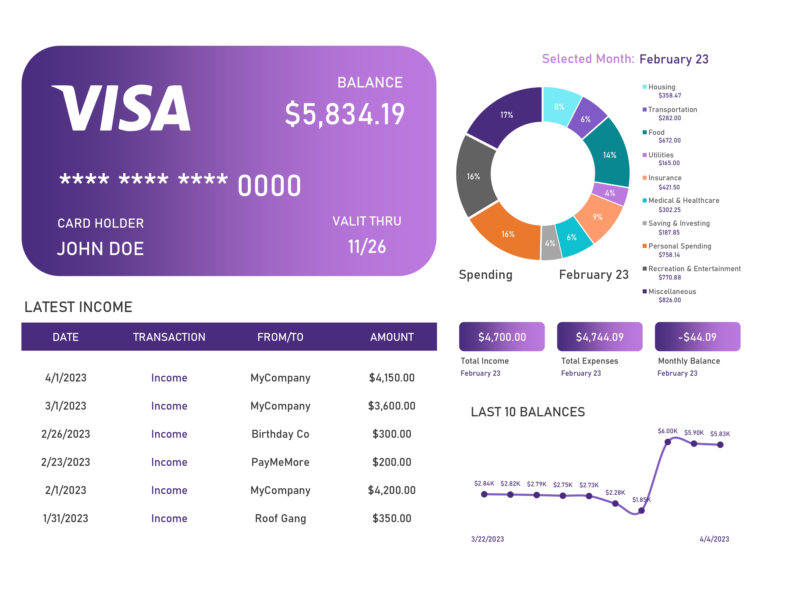

# Personal Budget Dashboard – Excel Project

Personal Finance Dashboard built using **Microsoft Excel** to track income, expenses, savings, and spending categories.

---

## Executive Summary

I developed an **Interactive Personal Budget Dashboard using Microsoft Excel** to help individuals monitor their financial activities. The dashboard provides a clear overview of income sources, monthly expenses, category-wise spending, and balance trends.

This dashboard allows users to easily track their financial health by analyzing spending patterns and identifying areas where expenses can be optimized.

---

## Business Problem

Managing personal finances can be challenging when income and expenses are scattered across multiple transactions. Without a centralized financial dashboard, it becomes difficult to understand spending patterns and track monthly savings.

Individuals need a simple analytical dashboard that answers questions such as:

- How much income is received each month?
- How much money is spent across different categories?
- What is the monthly balance after expenses?
- How are savings changing over time?

A data-driven dashboard helps individuals make better financial decisions.

---

## Interactive Excel Dashboard

### Personal Budget Overview

---

## KPI Summary

- **Total Income (February 2023):** $4,700  
- **Total Expenses (February 2023):** $4,744.09  
- **Monthly Balance:** -$44.09  
- **Current Account Balance:** $5,834.19  

---

## Key Insights

- The dashboard tracks income from multiple sources including salary and additional payments.
- Personal spending categories include housing, food, transportation, utilities, and entertainment.
- The donut chart visualizes the distribution of expenses across categories.
- The balance trend chart helps monitor financial changes over time.
- The latest income table allows users to quickly review recent transactions.

---

## Business Recommendations

- Monitor high spending categories such as personal spending and food.
- Set monthly spending limits for non-essential categories.
- Track balance trends regularly to avoid negative monthly balances.
- Use budgeting dashboards to maintain better financial discipline.

---

## Tools & Technologies Used

- Microsoft Excel  
- Pivot Tables  
- Charts & Data Visualization  
- Data Cleaning  
- Dashboard Design  

---

## Impact

This dashboard demonstrates how financial analytics can help individuals:

- Track income and expenses efficiently
- Understand spending patterns
- Monitor balance trends
- Make better financial decisions

---
